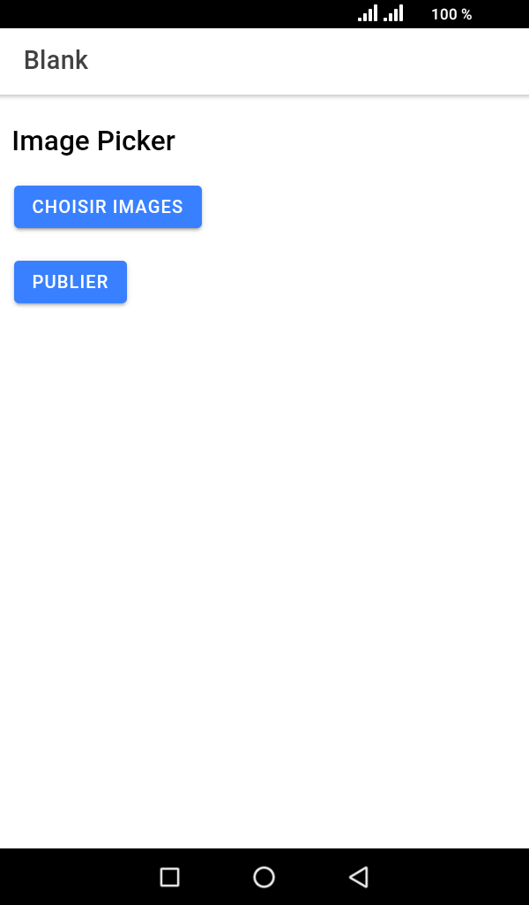
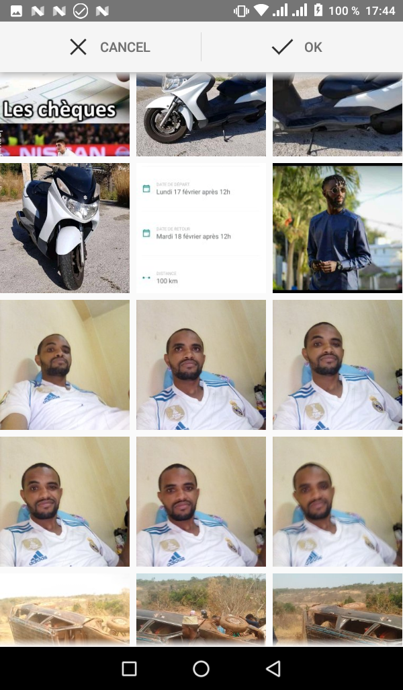
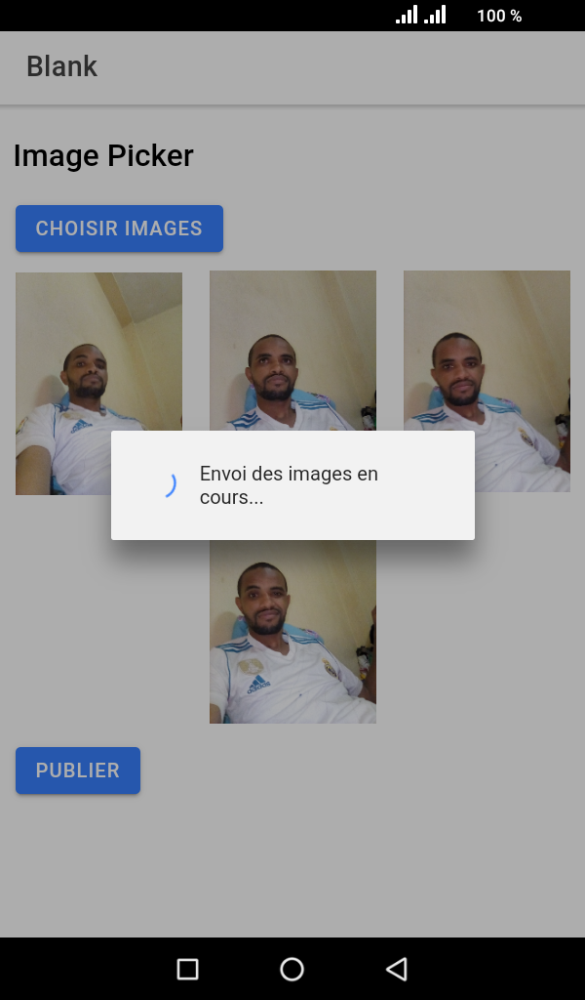
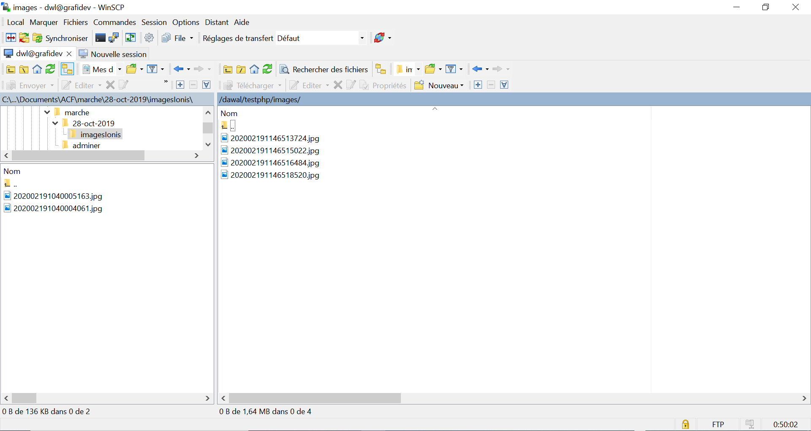

# ionic-image-pic
Ceci est un exemple simple de recupèration d'image dans une galerie sur ANDROID ou IOS. Après avoir recupèrer l'image, on l'envoi sur un serveur (php dans notre exemple). Le serveur se chargera de recupèrer les images et de les stocker dans un dossier.

Dans cet exemple j'utilise cordova pour genrer l'apk sur android. L'apk qui a été généré est disponible dans le dossier APK/

### Technologies utilisées 
Ionic - version 5
Angular - version 8
@ionic-native/image-picker - version 5.21.5

Cordova - version 9.0.0

### Getting Started / Pour commencer

1. il faut d'abord recupèrer le projet avec la commande suivante

`git clone https://github.com/2boubacar10/ionic4_image_picker_upload.git`

2. `cd ionic4_image_picker_upload`

3. `npm install`

4. `ionic serve` ou `ionic cordova build android` pour générer l'apk ou `ionic cordova run android` pour lancer l'application sur votre émulateur

### Fonctionnalités

- bouton pour choisir les images
- zone pour afficher les images
- bouton pour envoyer les images sur le serveur

### Screen Shots

